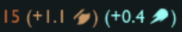

# The goal of this project is to be more familiar with multiplayer and games in general.

## State
It's currently nowhere near finished

### CLient
- [x] Ui
    - [x] Dynamic values
    - [x] Events
    - [x] Basic styling
    - [X] Simple widgets
    - [x] Lots of usefull widgets
    - [x] Image in texts (Something like LoL does )
- [x] Gui windows (Stole from my game Vupa lol)
- [x] Asset loading
    - [x] Config
    - [x] Sprites
    - [x] Strong error resistance
- [ ] Gameplay
    - [ ] Can create, join and leave games
    - [ ] General and private chats
    - [ ] Can play games vs other players
    - [ ] Can play games vs bots

### Server
- [x] Simple server that accept incomming connections
- [ ] Accounts
- [ ] Basic security (https)
- [ ] Game manager
    - [x] Stores players and handle their disconnection cleanly
    - [x] Game creation & joining
    - [ ] Actual gameplay 
        - [ ] Turns
        - [x] Move pieces
        - [x] Move validation (possible)
        - [ ] Move validation (legal)

### Shared
- [ ] Chess
    - [x] Boards and Bitboards
    - [x] Colors, Pieces, Square, Positions
    - [ ] Move validation
    - [ ] Move generation 
- [ ] Strong error handling

